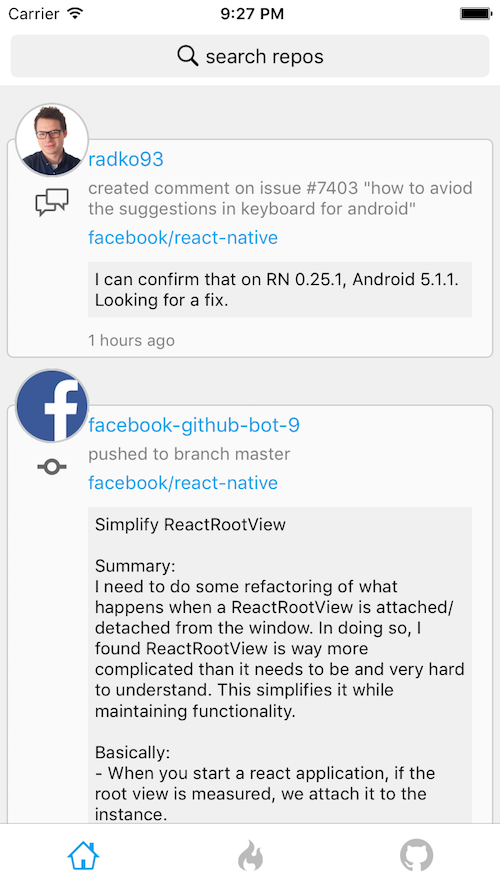
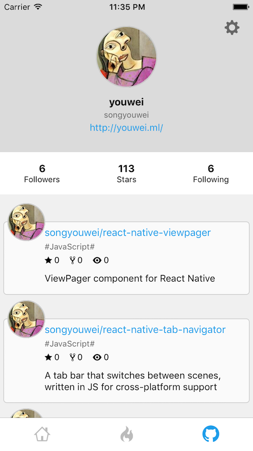
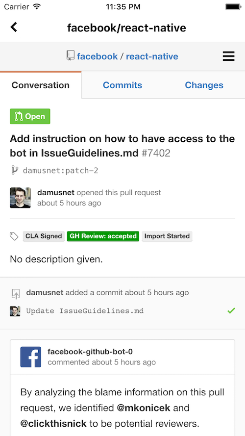
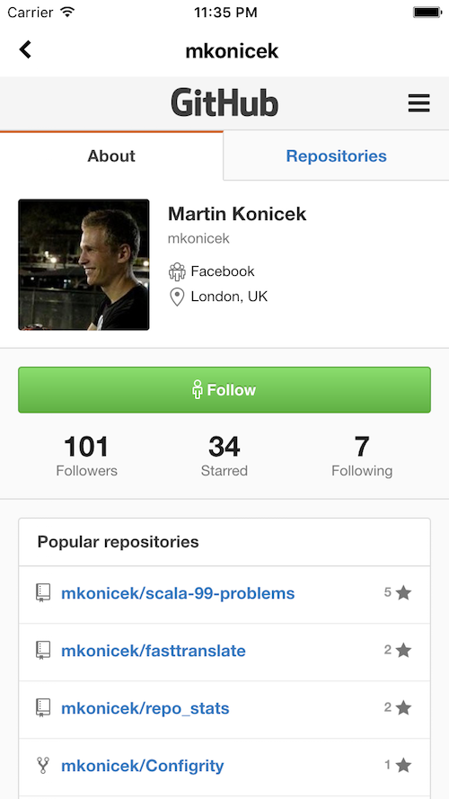

## GitSeek
A Github app powered by React Native, written in ES6

[](https://github.com/feross/standard)
[](CONTRIBUTING.md#pull-requests)


**It's still under development!!**

## Platform
iOS & Android

## Dependencies
```
"dependencies": {
  "octokat": "^0.4.17",
  "react": "^0.14.8",
  "react-native": "^0.24.1",
  "react-native-fs": "^1.3.0",
  "react-native-router-flux": "^2.3.13",
  "react-native-tab-navigator": "git+ssh://git@github.com:songyouwei/react-native-tab-navigator.git",
  "react-native-vector-icons": "^1.3.4"
}
```

## Screens









## License
GNU Public License V3
